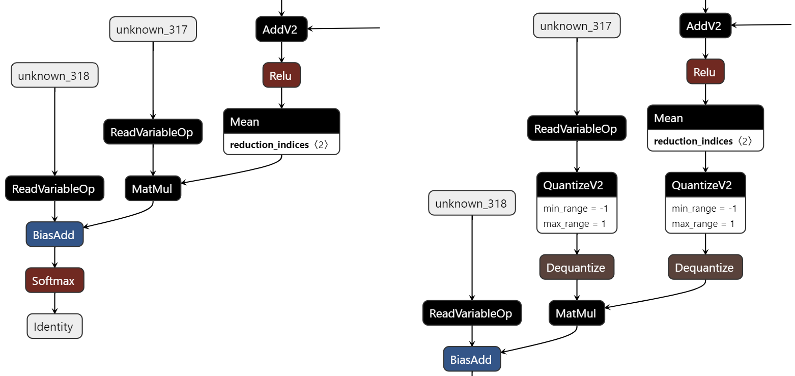

Step-by-Step
============

This document is used to record the experimental code of modifying unfrozen graph_def, which is extracted from saved_model, and saving back.


# Prerequisite

## 1. Environment

### Installation
```shell
# Install Intel® Neural Compressor
pip install neural-compressor
```

### Install Requirements
```shell
pip install -r requirements.txt
```
> Note: Validated TensorFlow [Version](/docs/source/installation_guide.md#validated-software-environment).

## 2. Prepare Pretrained model

The pretrained model is provided by [Keras Applications](https://keras.io/api/applications/). prepare the model, Run as follow: 
 ```
python prepare_model.py --output_model=./resnet50
 ```
`--output_model ` the model should be saved as SavedModel format.

## 3. Prepare Dataset
ImageNet dataset of tf records format is required.

Please refer to image_recognition folder for details.

# Conversion
## 1. Convert without inserting qdq
This step is to verify the graph_def extracted from saved_model can be successfully saved back.
The reconstruted model will be saved to './converted_resnet50'. 
By checking the directory of this saved_model, we can see the variables folder is not empty.
  ```shell
  python convert.py
  ```
When running this script, two pb files will be dumped: ```extracted_graph_def.pb``` and ```converted_graph_def.pb```. 
They represent the graph_def before and after inserting qdq.

Because we didn't insert qdq in this step, they should be the same.

## 2. Run Benchmark 
This step is to verify the reconstructed saved_model can be inferenced without accuracy drop.
  ```shell
  python run_benchmark.py --dataset_location=/path/to/imagenet/dataset
  ```

The following results are expected to be shown:
  ```shell
  ---------------------------------------------------------
  The infrence results of original resnet50 with TF2.x API
  Batch size = 1
  Latency: 32.887 ms
  Throughput: 30.407 images/sec
  Accuracy: 0.61386
  ---------------------------------------------------------
  The infrence results of converted resnet50 with TF2.x API
  Batch size = 1
  Latency: 34.324 ms
  Throughput: 29.134 images/sec
  Accuracy: 0.61386
  ```
This proves that the reconstructed model can still be inferenced with correct accuracy.

## 3. Convert with inserting qdq
This step is to verify the graph_def with inserted qdq can be successfully saved back.
The reconstruted model will be saved to './converted_resnet50'.
By checking the directory of this saved_model, we can see the variables folder is not empty.
  ```shell
  python convert.py --insert_qdq
  ```

When running this script, two pb files will be dumped: ```extracted_graph_def.pb``` and ```converted_graph_def.pb```. 
They represent the graph_def before and after inserting qdq.

By comparing the graph_def, we can see the qdq is successfully inserted before MatMul:

<div align=center>
<a target="_blank" href="./compare.png">
    
</a>
</div>

## 4. Run Benchmark 
This step is to verify the model inserted qdq can be inferenced. And there should be significant accuracy drop becuase the calibration is not done. The min-max value of qdq is fixed to be -1 and 1.
  ```shell
  python run_benchmark.py --dataset_location=/path/to/imagenet/dataset
  ```

The following results are expected to be shown:
  ```shell
  ---------------------------------------------------------
  The infrence results of original resnet50 with TF2.x API
  Batch size = 1
  Latency: 33.061 ms
  Throughput: 30.247 images/sec
  Accuracy: 0.61386
  ---------------------------------------------------------
  The infrence results of converted resnet50 with TF2.x API
  Batch size = 1
  Latency: 31.591 ms
  Throughput: 31.655 images/sec
  Accuracy: 0.50495
  ```
This proves that the qdq pattern has been successfully inserted, and the saved_model can still be inferenced.

## 5. Dump Graph
We can also dump graph from the saved_model to check if the conversion is successful:
  ```shell
  python dump_graph_from_saved_model.py --input_model=./converted_resnet50
  ```
The dumped graph will be saved at './dumped_graph.pb'